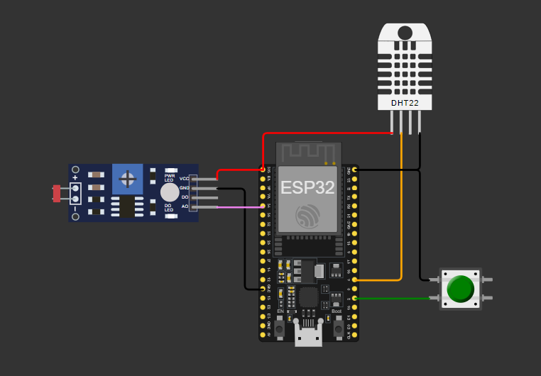

# FIAP - Faculdade de Informática e Administração Paulista 

<p align="center">
<a href= "https://www.fiap.com.br/"></a>
</p>

<br>

# Sistema de Monitoramento IoT com ESP32

---

## 🚀 **Contexto do Desafio Hermes Reply**

> **Este projeto faz parte do desafio proposto pela Hermes Reply para a Fase 4 do curso FIAP, cujo objetivo é simular um sistema de monitoramento industrial utilizando ESP32 e sensores virtuais. A iniciativa visa aproximar os alunos das práticas de Indústria 4.0, promovendo a coleta, análise e visualização de dados em ambientes simulados, preparando para desafios reais de automação e inteligência artificial.**

A Hermes Reply atua com soluções digitais aplicadas à indústria, com foco em monitoramento inteligente de equipamentos. A coleta de dados em ambientes industriais modernos é realizada através de sensores conectados a sistemas embarcados, como o ESP32, monitorando variáveis como temperatura, vibração e luminosidade. O projeto simula esse cenário, utilizando plataformas online de simulação de circuitos e sensores (Wokwi, VSCode, PlatformIO), para criar um circuito virtual, coletar dados e realizar análises iniciais.

---

## Grupo 36

## 👨‍🎓 Integrantes: 
- <a href="https://github.com/FelipeSabinoTMRS">Felipe Sabino da Silva</a>
- <a href="https://github.com/juanvoltolini-rm562890">Juan Felipe Voltolini</a>
- <a href="https://github.com/Luiz-FIAP">Luiz Henrique Ribeiro de Oliveira</a> 
- <a href="https://github.com/marcofiap">Marco Aurélio Eberhardt Assimpção</a>
- <a href="https://github.com/PauloSenise">Paulo Henrique Senise</a> 


## 👩‍🏫 Professores:
### Tutor(a) 
- <a href="https://github.com/Leoruiz197">Leonardo Ruiz Orabona</a>
### Coordenador(a)
- <a href="https://github.com/agodoi">André Godoi</a>


**Enterprise Challenge - Sprint 2 - Reply**


## Descrição
Este projeto simula um circuito funcional com ESP32 e 3 sensores virtuais (temperatura, vibração e luminosidade) para coleta e análise de dados em tempo real.

<p align="center">
<a></a>
</p>

## Sensores Utilizados
- **DHT22**: Sensor de temperatura e umidade
- **SW-420**: Sensor de vibração (simulado com botão)
- **LDR**: Sensor de luminosidade (fotorresistor)

### 🎯 **Justificativa dos Sensores Utilizados**

- **DHT22 (Temperatura e Umidade):** Essencial para monitorar condições ambientais que podem afetar o funcionamento de máquinas e a qualidade do produto.
- **SW-420 (Vibração):** Importante para detectar anomalias mecânicas e prevenir falhas em equipamentos rotativos.
- **LDR (Luminosidade):** Útil para monitorar iluminação em ambientes industriais, garantindo condições ideais de trabalho e segurança.

### 🎮 **Interação com Sensores Virtuais**

**Como testar no Wokwi:**
- **DHT22**: Clique no sensor e ajuste temperatura/umidade manualmente
- **SW-420**: Use o botão/switch para simular vibração (0/1)
- **LDR**: Ajuste o slider de luminosidade (0-4095)

## Estrutura do Projeto
```
├── README.md                          # Este arquivo
├── diagram.json                       # Configuração do circuito Wokwi
├── wokwi.toml                        # Configuração do projeto Wokwi
├── platformio.ini                    # Configuração PlatformIO
├── src/
│   └── main.cpp                      # Código principal Arduino/ESP32
├── sensor.ingest.local/
│   ├── servidor.py                   # Servidor Flask para ingestão de dados
│   └── config.py                     # Configurações centralizadas
├── scripts/
│   ├── setup-oracle-docker.sh       # Script para configurar Oracle (Linux/macOS)
│   ├── setup-oracle-docker.bat      # Script para configurar Oracle (Windows Batch)  
│   └── setup-oracle-docker.ps1      # Script para configurar Oracle (Windows PowerShell)
├── data/
│   └── sensor_data.csv              # Dados coletados dos sensores
├── analysis/
│   └── data_visualization.py        # Script para gerar gráficos
├── docs/
│   ├── images/                      # Prints do circuito e gráficos
│   └── TROUBLESHOOTING.md           # Guia de solução de problemas
└── .vscode/                         # Configurações do VS Code
    ├── settings.json
    └── launch.json
```

## Como Executar

### 1. Simulação no Wokwi
1. Acesse [Wokwi.com](https://wokwi.com)
2. Crie um novo projeto ESP32
3. Copie o conteúdo de `diagram.json` para o diagrama
4. Copie o código de `src/main.cpp` para o editor
5. Execute a simulação

### 2. Análise dos Dados
```bash
# Instalar dependências Python
pip3 install -r requirements.txt
```

### 3. Banco de Dados Oracle (Opcional)
Para usar o sistema completo com persistência de dados:

#### **🐳 Subir Oracle Free no Docker**

**Pré-requisitos:**
- Docker instalado ([Docker Desktop](https://www.docker.com/products/docker-desktop/))
- 8GB+ de RAM disponível

**Passo a passo:**

#### **🤖 Opção Automática (Recomendada)**

**🐧 Linux/macOS:**
```bash
# Execute o script automatizado
./scripts/setup-oracle-docker.sh
```

**🪟 Windows:**
```cmd
REM Opção 1: Script Batch (Command Prompt)
scripts\setup-oracle-docker.bat
```
```powershell
# Opção 2: PowerShell (Recomendado)
.\scripts\setup-oracle-docker.ps1

# Com opções avançadas:
.\scripts\setup-oracle-docker.ps1 -Force              # Remove container existente sem perguntar
.\scripts\setup-oracle-docker.ps1 -SkipMemoryCheck    # Pula verificação de memória
```

#### **📋 Opção Manual**
```bash
# 1. Baixar e executar Oracle Database 23c Free
docker run -d \
  --name oracle-free \
  -p 1521:1521 \
  -p 5500:5500 \
  -e ORACLE_PWD=123456 \
  -e ORACLE_CHARACTERSET=AL32UTF8 \
  -v oracle-data:/opt/oracle/oradata \
  container-registry.oracle.com/database/free:latest

# 2. Aguardar inicialização (pode levar 5-10 minutos)
echo "⏳ Aguardando Oracle inicializar..."
docker logs -f oracle-free

# 3. Verificar se está rodando
docker ps | grep oracle-free
```

**Aguarde ver esta mensagem:**
```
DATABASE IS READY TO USE!
```

#### **🔧 Conectar ao Banco**

```bash
# Conectar via SQL*Plus (opcional, para testes)
docker exec -it oracle-free sqlplus sys/123456@FREEPDB1 as sysdba

# Ou conectar como usuário FIAP
docker exec -it oracle-free sqlplus fiap/123456@FREEPDB1
```

#### **📋 Configurações para o Servidor Python**

Edite as configurações conforme seu banco de dados Oracle no `sensor.ingest.local/config.py`:

```python
# Configurações do Banco Oracle
DB_CONFIG = {
  "user": "fiap",
  "password": "123456", 
  "dsn": "localhost:1521/FREEPDB1", # Configurado para porta mapeada do Docker
  "table_name": "sensor_readings"
}  
```

#### **🛑 Comandos Úteis do Docker**

```bash
# Parar o banco
docker stop oracle-free

# Iniciar novamente 
docker start oracle-free

# Ver logs
docker logs oracle-free

# Remover completamente (CUIDADO: perde dados!)
docker rm -f oracle-free
docker volume rm oracle-data
```

### 4. Servidor de Ingestão (Opcional)
Para receber dados em tempo real do ESP32 e armazenar no Oracle:

```bash
# Pré-requisitos
pip3 install flask oracledb

# As configurações estão centralizadas em config.py
# Para conexão com banco de dados Oracle, edite o arquivo sensor.ingest.local/config.py

# Iniciar servidor
cd sensor.ingest.local
python3 servidor.py (mac)
python servidor.py (windows)
```
Após rodar `servidor.py` copie o endereço do servidor para o `main.cpp`

<p align="center">
<a></a>
</p>

```bash
 * Debug mode: on
WARNING: This is a development server. Do not use it in a production deployment. Use a production WSGI server instead.
 * Running on all addresses (0.0.0.0)
 * Running on http://127.0.0.1:8000
 * Running on http://192.168.100.161:8000
Press CTRL+C to quit
 * Restarting with watchdog (windowsapi)
Conectado ao Oracle DB com sucesso!
A tabela 'sensor_readings' já existe.
🚀 Iniciando servidor de ingestão de dados IoT...
 * Debugger is active!
 * Debugger PIN: 253-939-424
```
```c
// *** Configurações do Servidor ***
// Lista de servidores para envio simultâneo
const char* serverIPs[] = {
  "192.168.2.126",    // Servidor principal
  "192.168.160.1",    // Servidor Wokwi
  "localhost",        // Servidor local
  "192.168.1.100"     // Servidor adicional
};
```

#### **⚙️ Configurações Personalizadas**

Todas as configurações estão centralizadas em `sensor.ingest.local/config.py`:

```python
# Banco de dados
DB_CONFIG = {
    "user": "fiap",
    "password": "123456", 
    "dsn": "localhost:1521/FREEPDB1",
    "table_name": "sensor_readings"
}

# Servidor
SERVER_CONFIG = {
    "host": "0.0.0.0",
    "port": 8000,
    "debug": True
}

# Sensores válidos
SENSOR_CONFIG = {
    "valid_types": ["temperature", "humidity", "vibration", "luminosity"]
}
```

#### **Endpoints Disponíveis:**
- `GET /data` - Recebe dados dos sensores
- `GET /get_all_data` - Lista todas as leituras
- `GET /health` - Status do servidor

#### **Como o ESP32 envia dados:**
```cpp
// Exemplo de URL para envio
POST http://servidor:8000/data
Content-Type: application/json
{
  "timestamp": 1234567890,
  "sensor_type": "temperature",
  "sensor_value": 25.5
}
```

#### **O que o Servidor Faz:**
1. **🔍 Verificação Automática**: Cria tabela Oracle se não existir
2. **📥 Ingestão de Dados**: Recebe dados via HTTP POST (JSON)
3. **✅ Validação**: Verifica parâmetros e tipos de dados
4. **🗄️ Persistência**: Armazena no Oracle Database
5. **📋 Consultas**: API para listar dados históricos
6. **🏥 Monitoramento**: Health check do sistema

#### **Características Técnicas:**
- **Porta**: 8000 (configurável)
- **Protocolo**: HTTP REST API
- **Banco**: Oracle Database (com auto-criação de tabelas)
- **Formato**: Dados em JSON/texto plano
- **Log**: Console com timestamps
- **Tratamento**: Rollback automático em caso de erro

### 5. Compilar e simular ESP32
```bash
# Compilar código ESP32
pio run
```
Após compilar, inicie a simulação no arquivo `diagram.json`


### 5. Análise dos Dados
```bash
# Instalar dependências Python
pip3 install -r requirements.txt

# Executar visualização
cd analysis
python3 data_visualization.py
```

### 6. Verificação do Sistema Completo

#### **🔍 Testar se tudo está funcionando:**

```bash
# 1. Verificar Oracle
docker ps | grep oracle-free  # Deve mostrar container rodando

# 2. Testar servidor Flask
curl http://localhost:8000/health
# Resposta esperada: {"status": "ok", "database": "ok", ...}

# 3. Simular dados do ESP32
curl -X POST http://localhost:8000/data \
  -H "Content-Type: application/json" \
  -d '{"timestamp": 1234567890, "sensor_type": "temperature", "sensor_value": 25.5}'
# Resposta: "Dados recebidos com sucesso"

# 4. Consultar dados salvos
curl http://localhost:8000/sensors
# Deve retornar JSON com os dados inseridos
```

### 7. Resultados Obtidos
O sistema gera automaticamente:
- 📊 **Gráfico de análise**: `docs/images/sensor_analysis.png`
- 📈 **Estatísticas detalhadas** no terminal
- 📄 **Dados CSV** prontos para análise
- 🗄️ **Dados no Oracle** (se usar servidor)
- 🐳 **Banco Oracle** rodando no Docker

## Casos de Uso

### 🎯 **Simulação Simples (Wokwi)**
**Para:** Demonstrações, aprendizado, prototipagem
```
1. Use apenas: Wokwi + Análise Python
2. Dados: CSV estático
3. Tempo: 5-10 minutos para configurar
```

### 🏗️ **Sistema Completo (Produção)**
**Para:** Projetos reais, IoT em escala, monitoramento contínuo
```
1. Use: Docker Oracle + ESP32 + Servidor Flask + Análise
2. Dados: Tempo real no banco
3. Tempo: 30-60 minutos para configurar
4. Passos: Seções 3 → 4 → 5 do README
```

### 📊 **Apenas Análise (Offline)**
**Para:** Análise de dados existentes
```
1. Use apenas: Python + CSV
2. Dados: Arquivo estático
3. Tempo: 2-5 minutos
```

## Funcionalidades Implementadas
- ✅ **Simulação ESP32**: Circuito virtual com 3 sensores no Wokwi
- ✅ **Sensores Configurados**: DHT22, SW-420, LDR com valores realistas
- ✅ **Código Arduino**: Leitura a cada 2 segundos com simulação de padrões
- ✅ **Servidor de Ingestão**: Flask + Oracle para dados em tempo real
- ✅ **Saída CSV**: Formato padronizado para análise
- ✅ **Visualização**: Gráficos automáticos com estatísticas
- ✅ **Documentação**: Instruções completas de reprodução

## Cenários Simulados
- **Temperatura**: 15°C a 35°C (ambiente interno)
- **Vibração**: 0-1023 (digital com ruído simulado)
- **Luminosidade**: 0-4095 (variação dia/noite)

## Componentes do Sistema

### 🔧 **ESP32 + Sensores (IoT)**
- **Hardware**: ESP32-DevKitC V4
- **Plataforma**: Wokwi Simulator
- **Linguagem**: C++ (Arduino Framework)
- **Sensores**: DHT22, SW-420, LDR

### 🖥️ **Servidor de Ingestão (Backend)**
- **Framework**: Flask (Python)
- **Banco de Dados**: Oracle Database
- **API**: REST endpoints para receber dados dos sensores
- **Funcionalidades**:
  - Recebe dados dos sensores ESP32 via HTTP
  - Armazena no Oracle Database
  - Valida e processa dados em tempo real
  - Endpoints para consulta e monitoramento

### 📊 **Análise de Dados (Analytics)**
- **Linguagem**: Python
- **Bibliotecas**: Matplotlib, Pandas, NumPy
- **Saída**: Gráficos e estatísticas detalhadas

## Fluxo de Dados Completo

```
🔧 ESP32 Sensors → 📡 HTTP Request → 🖥️ Flask Server → 🐳 Docker Oracle
                                           ↓              ↓
📊 Python Analysis ← 📄 CSV Export ← 🔍 Data Query ← 🗄️ Oracle DB
```

## Arquivos Importantes
- 🔧 `platformio.ini`: Configuração do PlatformIO
- 🖥️ `sensor.ingest.local/servidor.py`: Servidor de ingestão de dados
- 🐳 `scripts/setup-oracle-docker.sh`: Setup automático do Oracle (Linux/macOS)
- 🪟 `scripts/setup-oracle-docker.bat`: Setup automático do Oracle (Windows Batch) 
- ⚡ `scripts/setup-oracle-docker.ps1`: Setup automático do Oracle (Windows PowerShell)
- ⚙️ `INSTRUÇÕES_IMPORTANTES.md`: Como evitar erros de debug

---
*Projeto desenvolvido para demonstrar conceitos de IoT e análise de dados.* 

### 🖼️ **Evidências Visuais da Simulação**

**Print do circuito montado na plataforma de simulação:**

> **[INSERIR AQUI UMA IMAGEM DO CIRCUITO NO WOKWI OU OUTRA PLATAFORMA]**
> 
> 

**Print do Monitor Serial mostrando leituras dos sensores:**

> **[INSERIR AQUI UM PRINT DO MONITOR SERIAL COM DADOS DOS SENSORES]**
> 
> 

**Print do gráfico gerado na análise dos dados:**

> **[INSERIR AQUI UM PRINT DO GRÁFICO GERADO PELA ANÁLISE PYTHON]**
> 
> 

---

### 🧑‍💻 **Trecho Representativo do Código**

```cpp
// Leitura do sensor de temperatura e umidade
float temperature = dht.readTemperature();
float humidity = dht.readHumidity();
Serial.print("Temperature: ");
Serial.println(temperature);
Serial.print("Humidity: ");
Serial.println(humidity);

// Leitura do sensor de vibração
int vibration = digitalRead(SW420_PIN);
Serial.print("Vibration: ");
Serial.println(vibration);

// Leitura do sensor de luminosidade
int luminosity = analogRead(LDR_PIN);
Serial.print("Luminosity: ");
Serial.println(luminosity);
```

> *O código acima exemplifica a leitura dos sensores e o envio dos dados para o Monitor Serial, simulando o comportamento de um sistema embarcado real.*

---

### 🔄 **Fluxo de Dados do Sistema**

```mermaid
graph TD;
  A["Sensores Virtuais (DHT22, SW-420, LDR)"] --> B["ESP32 (Simulação)"];
  B --> C["Monitor Serial / Exportação CSV"];
  C --> D["Análise Python (Pandas/Matplotlib)"];
  D --> E["Geração de Gráficos e Insights"];
```



---

### 📈 **Insights Iniciais da Análise**

> **[INSERIR AQUI UMA BREVE ANÁLISE DOS DADOS COLETADOS. EXEMPLO:]**
>
> Durante a simulação, observou-se que a temperatura variou entre XX°C e YY°C, a vibração apresentou picos em determinados momentos simulando possíveis falhas, e a luminosidade oscilou conforme o ajuste do sensor virtual. O gráfico gerado permitiu identificar padrões e anomalias nos dados, demonstrando a utilidade do monitoramento contínuo em ambientes industriais.

---

### ✅ **Checklist dos Entregáveis**

- [x] Imagens da simulação do circuito (print Wokwi ou similar)
- [x] Lista e justificativa dos sensores virtuais
- [x] Código-fonte comentado da leitura e visualização de dados simulados
- [x] Prints do comportamento da simulação (Monitor Serial ou simulação de dados)
- [x] Gráficos e insights iniciais da análise exploratória
- [x] README estruturado e explicativo

---

### 📚 **Referências e Agradecimentos**

- [Wokwi - Simulador de Circuitos](https://wokwi.com/)
- [PlatformIO](https://platformio.org/)
- [FIAP](https://www.fiap.com.br/)
- [Hermes Reply](https://www.reply.com/hermes-reply/)
- Datasheets dos sensores: [DHT22](https://cdn.sparkfun.com/datasheets/Sensors/Temperature/DHT22.pdf), [SW-420](https://components101.com/sensors/vibration-sensor-module-sw-420), [LDR](https://www.electronics-tutorials.ws/io/photoresistor.html)

> **Agradecimentos à Hermes Reply e à FIAP pela proposta do desafio e apoio ao desenvolvimento do projeto.**

---