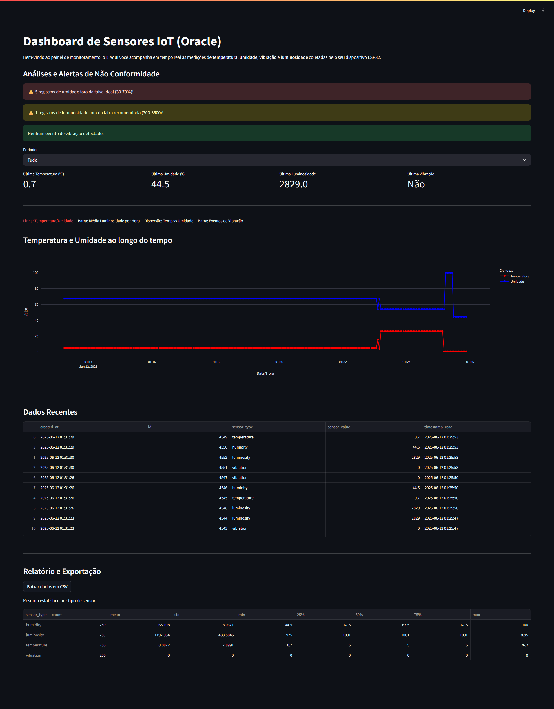
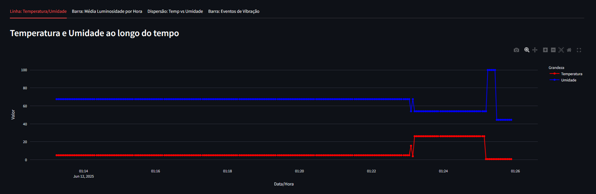
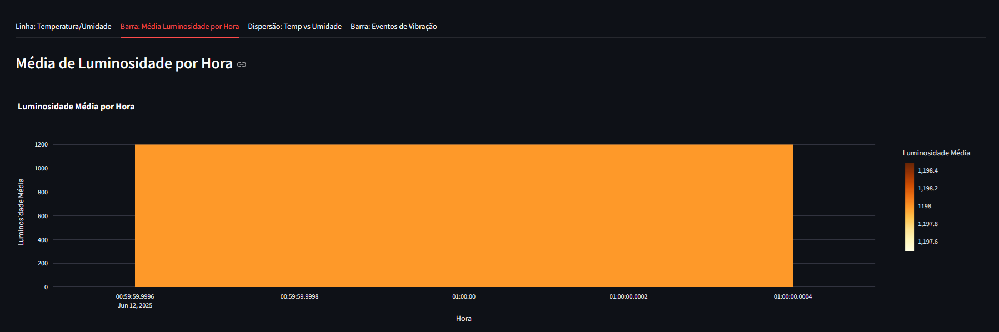
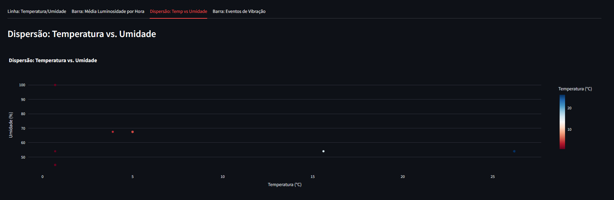
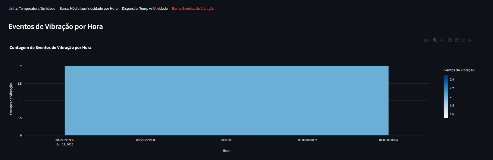
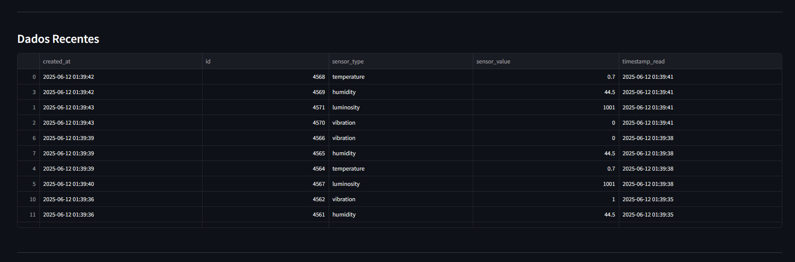
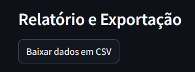
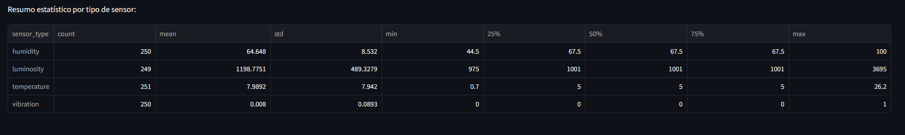
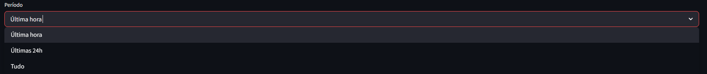
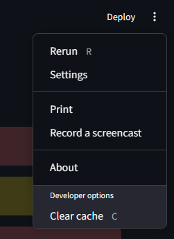

# Dashboard de Sensores IoT (Oracle)

Este dashboard foi desenvolvido em Streamlit para visualização e análise dos dados coletados por sensores IoT (temperatura, umidade, vibração e luminosidade) e armazenados em um banco de dados Oracle.

---

## Visão Geral do Dashboard


*Visão geral do dashboard com alertas de não conformidade para umidade, luminosidade e vibração.*

---

## Objetivo

Permitir o acompanhamento em tempo real e a análise histórica das medições dos sensores conectados ao seu sistema IoT, facilitando a visualização de tendências, correlações e eventos relevantes.

---

## Recursos do Dashboard

- **Visualização em tempo real** dos dados coletados
- **Filtro de período** (última hora, últimas 24h, tudo)
- **Cards de métricas rápidas** (últimos valores de cada grandeza)
- **Análises e Alertas de Não Conformidade**:
  - Destaca automaticamente valores fora da faixa ideal para umidade, luminosidade e eventos de vibração
- **Gráficos interativos** organizados em abas:
  - **Linha:** Temperatura e Umidade ao longo do tempo
  - **Barra:** Média de Luminosidade por Hora
  - **Dispersão:** Temperatura vs. Umidade
  - **Barra:** Contagem de Eventos de Vibração por Hora
- **Tabela de dados recentes**
- **Relatório e Exportação**:
  - Botão para baixar todos os dados em CSV
  - Resumo estatístico por tipo de sensor
- **Layout responsivo** e visual moderno

---

## Análises e Alertas de Não Conformidade

O dashboard realiza automaticamente análises de não conformidade e exibe alertas visuais no topo da página para facilitar a identificação de situações críticas:

- **Umidade fora da faixa ideal:**
  - Alerta se algum valor de umidade estiver abaixo de 30% ou acima de 70%.
- **Luminosidade fora da faixa recomendada:**
  - Alerta se algum valor de luminosidade estiver abaixo de 300 ou acima de 3500.
- **Eventos de vibração detectados:**
  - Alerta se houver qualquer evento de vibração (valor 1).

Esses limites podem ser facilmente ajustados no código conforme a necessidade do seu projeto.

---

## Relatório e Exportação

- **Download dos dados em CSV:**
  - Permite baixar todos os dados coletados para análise externa ou arquivamento.
- **Resumo estatístico por tipo de sensor:**
  - Exibe média, mínimo, máximo, desvio padrão e outros indicadores para cada grandeza coletada.

---

## Gráficos Disponíveis

### Linha: Temperatura e Umidade ao longo do tempo

*Evolução da temperatura e umidade ao longo do tempo.*

### Barra: Média de Luminosidade por Hora

*Média de luminosidade registrada em cada hora.*

### Dispersão: Temperatura vs. Umidade

*Relação entre temperatura e umidade, útil para identificar correlações.*

### Barra: Eventos de Vibração por Hora

*Contagem de eventos de vibração detectados em cada hora.*

---

## Tabela de Dados Recentes


*Visualização dos registros mais recentes recebidos pelo sistema.*

---

## Relatório e Exportação


*Botão para baixar todos os dados em CSV.*


*Resumo estatístico por tipo de sensor: média, mínimo, máximo, desvio padrão, etc.*

---

## Filtro de Período


*Selecione o período desejado para análise: última hora, últimas 24h ou tudo.*

---

## Menu de Configurações


*Menu do Streamlit com opções para atualizar, imprimir, gravar screencast, limpar cache, etc.*

---

## Como Rodar o Dashboard

1. **Instale as dependências:**
   ```bash
   pip install streamlit pandas requests plotly
   ```
2. **Certifique-se de que o servidor Flask está rodando na porta 8000.**
3. **No terminal, execute:**
   ```bash
   streamlit run data/dashboard.py
   ```
4. **Acesse o dashboard pelo navegador:**
   - O endereço padrão será: [http://localhost:8501](http://localhost:8501)

---

## Dicas de Uso

- Use o filtro de período para analisar dados recentes ou históricos.
- Passe o mouse sobre os gráficos para ver detalhes de cada ponto.
- Utilize as abas para alternar entre diferentes tipos de análise.
- Consulte a tabela de dados recentes para ver os últimos registros recebidos.
- Fique atento aos alertas de não conformidade no topo do dashboard.
- Utilize o botão de download para exportar os dados em CSV e o resumo estatístico para análises rápidas.

---

## Dependências
- [Streamlit](https://streamlit.io/)
- [Pandas](https://pandas.pydata.org/)
- [Requests](https://docs.python-requests.org/)
- [Plotly](https://plotly.com/python/)

---

Se tiver dúvidas ou quiser sugerir melhorias, fique à vontade para contribuir! 